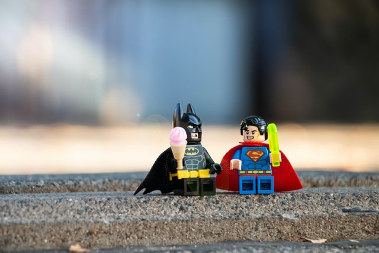

<h1>Team Bio Page</h1>
Meet students of the Interactive Media Program from Fanshawe College, Evica Mai and John Doe! This is an interatcive team profile card website, where the introductions of each member of the duo group is presented along with a picture. 
There are simple transitions incoporated and a button link to switch between the two profiles.

<h2>Collaborators:</h2>
<ul>
<li>Evica Mai @evica-ai</li>
<li>John Doe @doe3829</li>
</ul>

-----------------------------------------------------------
<h2>Built with:</h2>
<ul>
<li>Basic css and html: flexbox layout and simple CSS3 animation and transitions</li>
<li>Includes images created from unsplash (stock image)s</li>
</ul>

-----------------------------------------------------------
<h2>License: MIT</h2>
